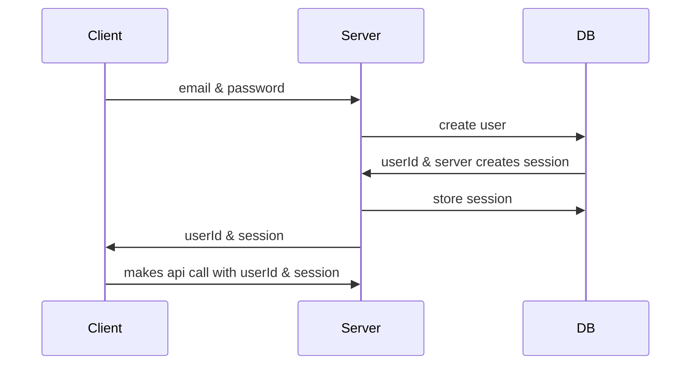
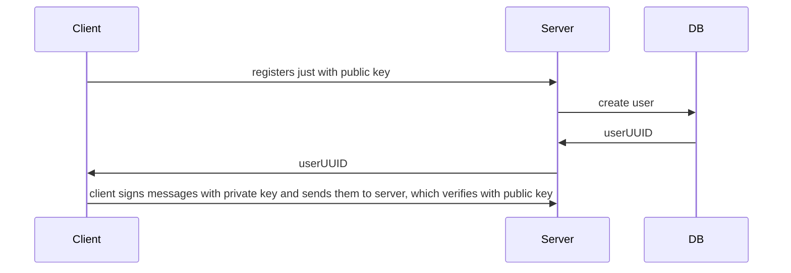

# Sessionless

*Sessionless* is an authentication protocol that uses the cryptography employed by Bitcoin and Ethereum to authenticate messages sent between a client and a server.

## Overview

This repository contains implementations of the Sessionless protocol in various languages and on various platforms.
Within this protocol, you create and store a private key on the client and then use that key to sign messages; those messages are then verified by the server via the public key associated with the client.
When you verify a message you also certify its provenance.
Because no other secret need be shared between client and server, **sessions are wholly unnecessary**.

Here is this in pictures.
A traditional authentication system looks like this:



Where Sessionless looks like this:



Note in Sessionless that a) no PII is necessary, b) no password is necessary, c) no shared secret (session) is passed between client and server, d) no PII, passwords, or sessions are stored in the database. 
A quick review of [OWASP's Identification and Authentication Failures] should hopefully illuminate the benefits of not having passwords and sessions. 

## Use cases

* Asking for email account creation before a user really engages with your content is one of the leading causes of bounce rates on web sites. 
With Sessionless you can provide [account continuity] without asking for email up front, leaving the credential entering for after a user engages with your site.
Consider an image creation site.
Use Sessionless to create an account behind the scenes. 
Save the image to that account, and ask for an email to send it to.
Now there's no friction to using your site, and users see its value before they have to sign up.

* Any time you want account based behavior on a single device like games on consoles. 
Remove the need to type out emails and passwords, but still maintain [account continuity].

* Devices that aren't usually connected to the internet like bluetooth devices (controllers, keyboards, headphones, etc).

Sessionless is a practical implmentation of *delegatable anonymous credentials*.
You can learn more about this in these papers:

- [Randomizable Proofs and Delegatable Anonymous Credentials][randomizable-proofs]
- [Digital Identity for Smart Cities][smart-cities]
- [Attribute-based anonymous credential: Delegation, traceability, and revocation][attribute-based]

## Getting started

> **Note**: This repo is a work in progress.

This repo is organized by language.
The APIs for [client](#client) and [server](#server) are defined below.
If you'd like to contribute, see the [Contributing](#contributing) section at the bottom of this README.
If you want to implement this system in your app, you'll likely want to start at your language's package manager ([npm], [CocoaPods], [Maven], etc). Links for those can be found at the end of this doc.

The code samples below are written in JavaScript, and is the case for a primary sessionless system. For examples in your language of choice, check the README in the language directory, or the documentation on the package manager's page. 

> **Note**: Part of the appeal of Sessionless is that it works on any device that can safely store a secret.
> No client can safely store a secret but we store sessions all over the place in clients, and in practice there's no real difference in the _storage_ of a session or private key.
> The benefit of the Sessionless private key is that it never has to leave the device, whereas a session does.
> See [Is Sessionless secure?][secure] for more details.
> Because Sessionless lets you pass messages through other devices, it can even be used to authenticate devices that aren't connected to the Internet
> None of this works on the web, though, because on web the only "safe" place to store data is in the _server_-generated cookie.
> To use Sessionless on the web you'll want to replace some part of your session with the private key for the user and do the signing on your server when a client makes a request.
> Since cookie-based auth has a lot of large entrenched players it may take some time before this functionality works out of the box.
> The maintainers of Sessionless plan to make this as seamless as possible but recognize it's an uphill battle. 

### Client

To get started on the client:

```javascript
import sessionless from 'sessionless';

sessionless.generateKeys();
```

When it comes time to register a new user:

```javascript
const publicKey = sessionless.getKeys().publicKey;
const payload = {
  publicKey
};
payload.signature = sessionless.sign(JSON.stringify(payload));
const user = await registerUser(payload); // left to the implementer
saveUser(user); // how you save the user is up to you, and not part of sessionless
```

For your API calls, add a signature:

```javascript
let payload = {
  timestamp: new Date().gettime() // Replay attacks are the only real attack surface for sessionless requests once they leave the client
                                  // so giving them a short ttl is suggested. Sessionless doesn't enforce this today, but it might in the future.
  foo: 'bar'
};

payload.signature = sessionless.sign(JSON.stringify(payload));
```

### Server

On the server, registering a user creates a tuple with a UUID and a public key, which will need to be persisted.
Subsequent calls from Sessionless will only include the UUID.
Persisting and retrieving keys is left to the implementer.

To register a new user:

```javascript
const payload = requestFromClient.payload;
const signature = payload.signature;

const publicKey = payload.publicKey;

const message = getMessageForPayload(payload); // This is left to the implementer. getMessage should return the message signed on the client.

if(sessionless.verifySignature(message, signature, publicKey)) {
  const uuid = sessionless.generateUUID();
  saveUser(uuid, publicKey); // saveUser left to the implementer
  const user = {
    uuid, 
    anythingElse
  };
  respondToClient(user); // left to the implementer
}
```

```javascript
const payload = requestFromClient.payload;
const signature = payload.signature;

const publicKey = getUserPublicKey(payload.UUID); // This is left to the implementer

const message = getMessageForPayload(payload); // This is left to the implementer. getMessage should return the message signed on the client.

if(sessionless.verifySignature(message, signature, publicKey)) {
  doCoolStuff();  // This left to the implementer
}
```

Private key recovery is important, but in a primary system you have options:

1. You can implement username and password recovery, Single sign-on (SSO), or private key cold storage.
2. You can opt not to persist a user beyond a single device. 

## Secondary systems

The real power of sessionless comes from the fact that since no secret is shared with every API call, calls can be passed off to untrusted devices and apps without fear of credentials getting stolen.
This means we can combine messages into one, and through that mechanism we can associate a public key in a secondary system with a user in a primary system. 

## Primary and secondary systems and why Sessionless is different

There are a few distributed identity approaches out there, but to my knowledge&mdash;and please let me know if I'm wrong since this stuff fascinates me&mdash;they're all trying to be a system where you have a singular canonical identity that the other identities tie into.
Sessionless doesn't try to do that.
The primary/secondary distinction is mostly one regarding whether the system provides account recovery of its own.
In fact, it's very possible that one primary system may be a secondary system to another primary system and vice versa. 

It's kind of like a transit system.
The primary systems are stations and stops that let you board trains and buses.
The secondary systems are the buses and trains taking you where you want to go.
Some stations let you transfer between lines.

On a client:

```javascript
const messageFromPrimary = receivedMessage;

const myMessage = {
  publicKey
};

myMessage.signature = sessionles.sign(JSON.stringify(myMessage));

const bothMessages = {
  messageFromPrimary,
  myMessage
};

sendMessageToPrimary(bothMessages);
```

Associating a public key with a primary system gives the secondary system the ability to interact with the primary without additional login or sharing of credentials.
If the primary system also returns a UUID, that secondary system can use that as authentication for their system.
It could even share that public key with a third system and make authenticated calls there **without any additional integration**. 

## Message passing

But primary/secondary isn't the only benefit to being able to pass messages to untrusted devices and apps.
You can pass signed API requests off to a second device or app as well.
That means you can build a platform where users can make API calls via a second user, and that second user can be notified of the result.
An example here is that any communication between devices done by NFC today (think ApplePay or transit cards), can now be done by a more long range communication protocol like BLE. 

* NFC is used to pass a credential to a payment device, and is used because its low range prevents interception.
If it is intercepted though, an attacker can use that credential.
With Sessionless, the passed credential is signed by the receiving device so even if an attacker intercepts the signed message from your device, they won't be able to use it, except on the device you were presumably already trying to use it.

* Another use case for message passing is between household devices.
If you have a TV device of any kind you've probably gone through the flow of scanning a QR code and then logging in on your phone, or typing in some letters and then logging in somewhere.
All of that nonsense can be gone with Sessionless, which can just log you in **without needing to type anything at all**.

* You could even imagine having additional interactive content coming through your TV.
Something as simple as letting you buy from your phone while an ad is playing, to choose your own adventures like [that one Black Mirror one].

## API

At its core, Sessionless is a loose wrapper around the [secp256k1] elliptic curve used by Bitcoin and Ethereum.
Though the cryptography itself is challenging, the surface area you need to use is quite small.
Since this is a multi-language repo, the below is written in pseudocode.
For language-specific typing, refer to the READMEs in the language directories themselves.

Function | What it does
:--------|:------------
`generateKeys(saveKeys?: keys => void, getKeys?: () => Keys)` | Generates a private/public keypair and stores it in the platform's secure storage. Takes an optional `saveKeys` function for platforms that don't have clear-cut secure storage. 
`getKeys()` | Gets keys from secure storage.
`sign(message: String)` | Signs a message with the user's private key.
`verifySignature(message: String, signature: String, publicKey: String)` | Verifies a given signature with a public key.
`generateUUID()` | Creates a unique UUID for a user.
`associateKeys(associationMessage: String, primarySignature: String, secondarySignature: String, publicKey: String)` | Associates a secondary's key with the user's primary key.
`revokeKey(message: String, signature: String, publicKey: String)` | Revokes a gateway's key from the user.

## Contributing

To add to this repo, feel free to make a [pull request][pr].
The following criteria will be used to determine whether to merge or not:

* Is the crypto library used well known for that language and actively maintained?
* Has the README been updated for that specific language?

## Further reading

* [What makes cryptography hard, and how does Sessionless make it easier?](./docs/Cryptography.md)
* [What makes this an authentication/identity system?](./docs/Authentication-and-identity.md)
* [How does this work, and why should I trust it?](./docs/How-does-this-work.md)
* [What's the primary/secondary thing (read this for how this relates to OAuth2.0)?](./docs/Primary-and-secondary.md)
* [Is this secure?](./docs/Is-Sessionless-secure.md)
* [How does this compare to Web 3.0?](./docs/Web-3.md)

[attribute-based]: https://www.sciencedirect.com/science/article/abs/pii/S1389128623005315
[cocoapods]: https://cocoapods.org
[maven]: https://maven.apache.org
[npm]: https://npmjs.org
[pr]: https://github.com/planet-nine-app/sessionless/pulls
[randomizable-proofs]: https://www.microsoft.com/en-us/research/wp-content/uploads/2009/08/anoncred.pdf
[secp256k1]: https://en.bitcoin.it/wiki/Secp256k1
[secure]: ./docs/Is-Sessionless-secure.md
[smart-cities]: https://static1.squarespace.com/static/5bede41d365f02ab5120b40f/t/65d305f9682e3158ed9386cf/1708328441775/ACM+Identity+Paper.pdf
[that one Black Mirror one]: https://en.wikipedia.org/wiki/Black_Mirror%3A_Bandersnatch
[OWASP's Identification and Authentication Failures]: https://owasp.org/Top10/A07_2021-Identification_and_Authentication_Failures/
[account continuity]: ./docs/Authentication-and-identity.md

