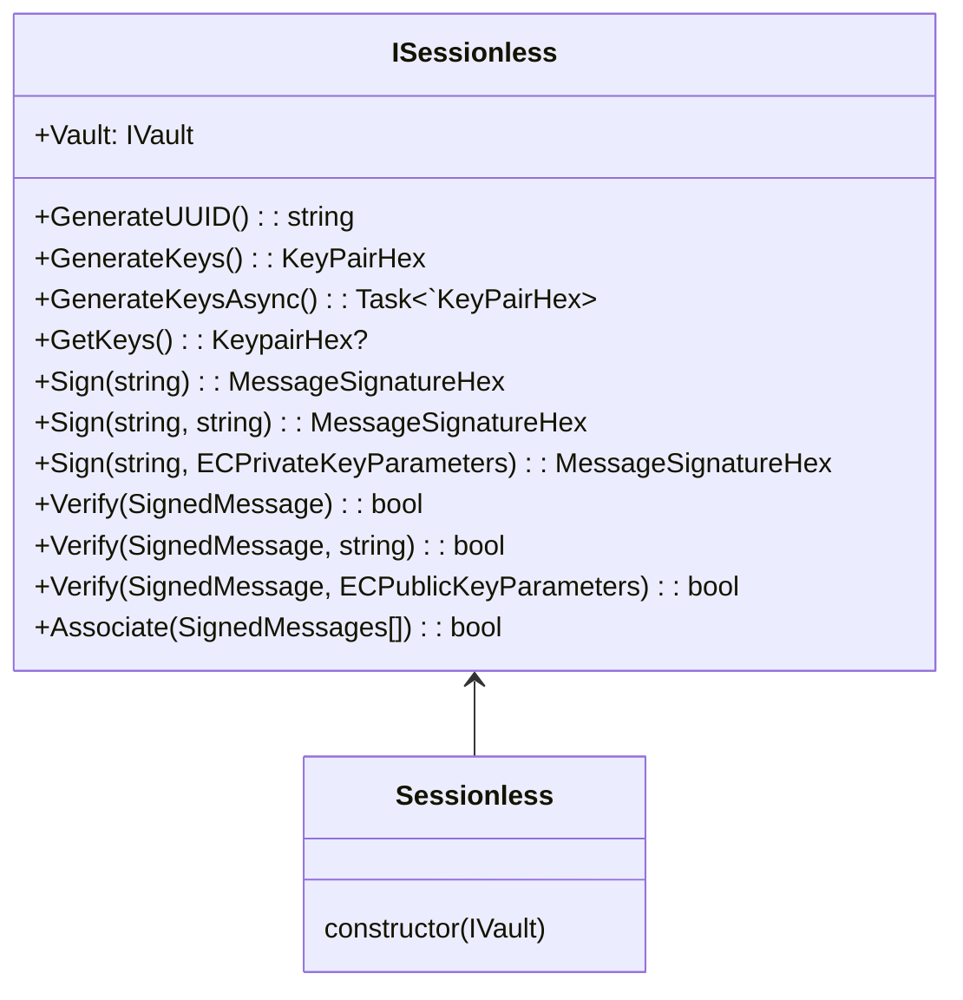
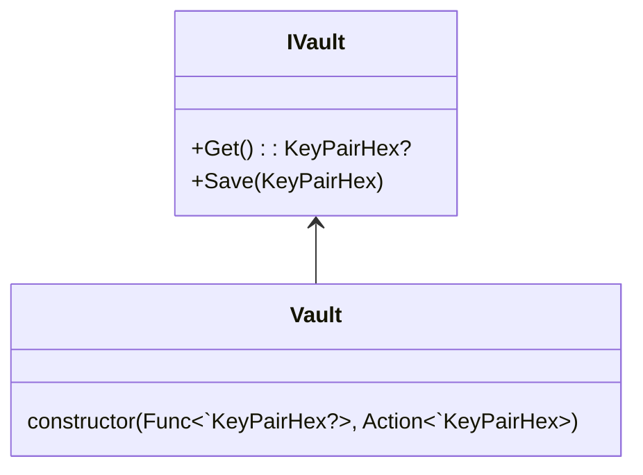
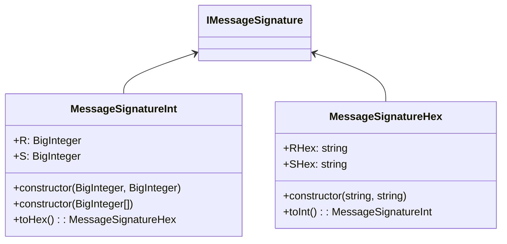
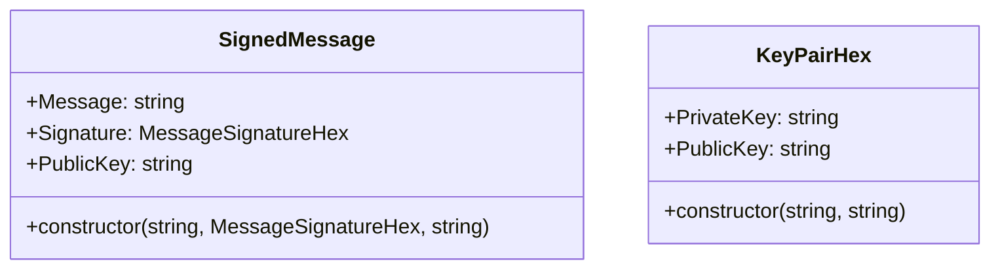
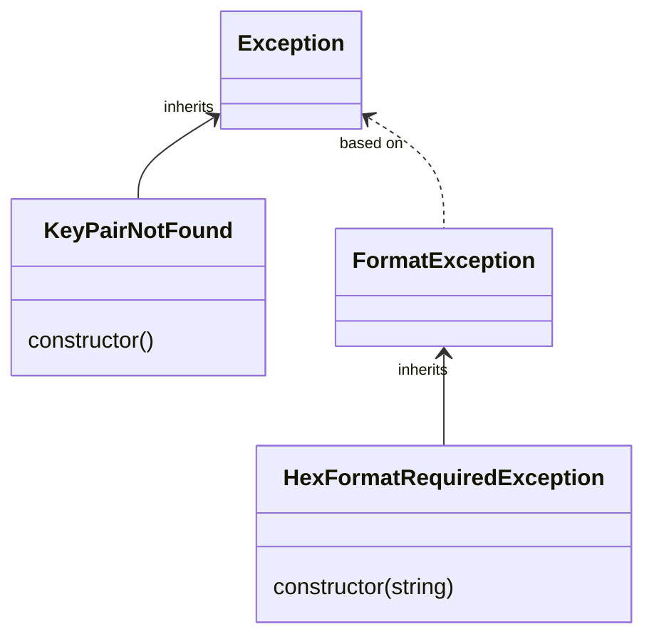

# .../Models/**ISessionless**.cs

```mermaid
classDiagram
  class ISessionless {
    +Vault: IVault
    +GenerateUUID(): string
    +GenerateKeys(): KeyPairHex
    +GenerateKeysAsync(): Task<`KeyPairHex>
    +GetKeys(): KeypairHex?
    +Sign(string): MessageSignatureHex
    +Sign(string, string): MessageSignatureHex
    +Sign(string, ECPrivateKeyParameters): MessageSignatureHex
    +Verify(SignedMessage): bool
    +Verify(SignedMessage, string): bool
    +Verify(SignedMessage, ECPublicKeyParameters): bool
    +Associate(SignedMessages[]): bool
  }
  class Sessionless {
    constructor(IVault)
  }
  ISessionless <-- Sessionless
```

# .../Models/**IVault**.cs

```mermaid
classDiagram
  class IVault {
    +Get(): KeyPairHex?
    +Save(KeyPairHex)
  }
  class Vault {
    constructor(Func<`KeyPairHex?>, Action<`KeyPairHex>)
  }

  IVault <-- Vault
```

# The rest:

### .../Impl/MessageSignature.cs

```mermaid
classDiagram
  class IMessageSignature { }
  class MessageSignatureInt {
    +R: BigInteger
    +S: BigInteger
    +constructor(BigInteger, BigInteger)
    +constructor(BigInteger[])
    +toHex(): MessageSignatureHex
  }
  class MessageSignatureHex {
    +RHex: string
    +SHex: string
    +constructor(string, string)
    +toInt(): MessageSignatureInt
  }

  IMessageSignature <-- MessageSignatureInt
  IMessageSignature <-- MessageSignatureHex
```

### More: .../Impl/...

```mermaid
classDiagram
  class SignedMessage {
    +Message: string
    +Signature: MessageSignatureHex
    +PublicKey: string
    +constructor(string, MessageSignatureHex, string)
  }

  class KeyPairHex {
    +PrivateKey: string
    +PublicKey: string
    +constructor(string, string)
  }
```

#### .../Impl/Exceptions/...

```mermaid
classDiagram
  class KeyPairNotFound {
    constructor()
  }
  class HexFormatRequiredException {
    constructor(string)
  }
  Exception "inherits" <-- KeyPairNotFound
  Exception "based on" <.. FormatException
  FormatException "inherits" <-- HexFormatRequiredException
```
