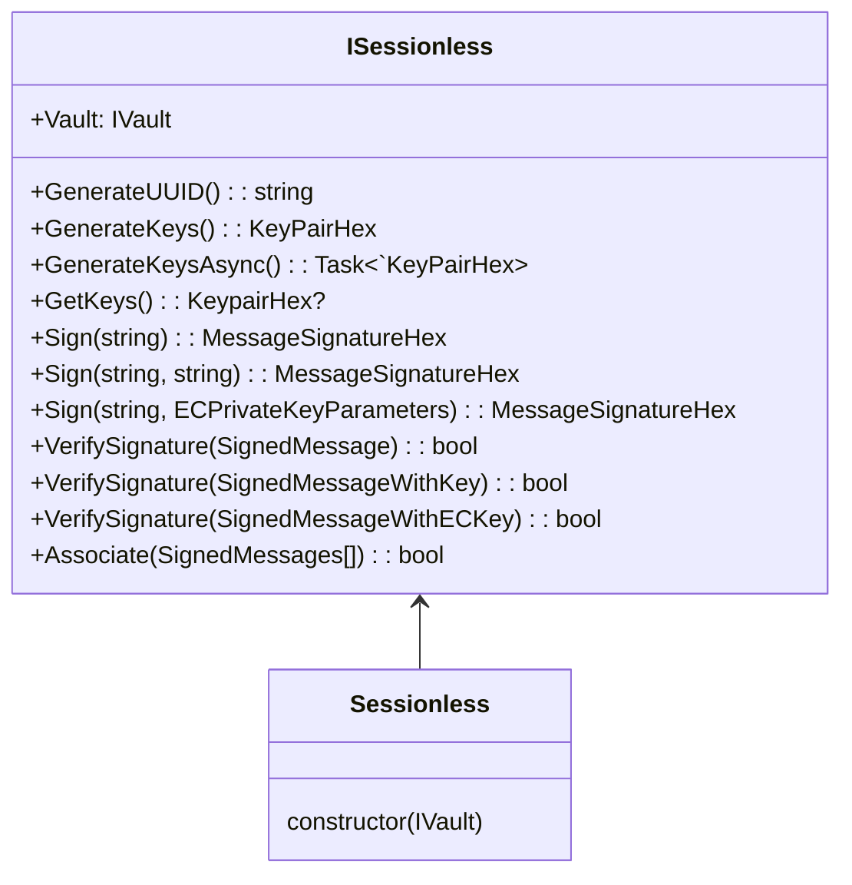
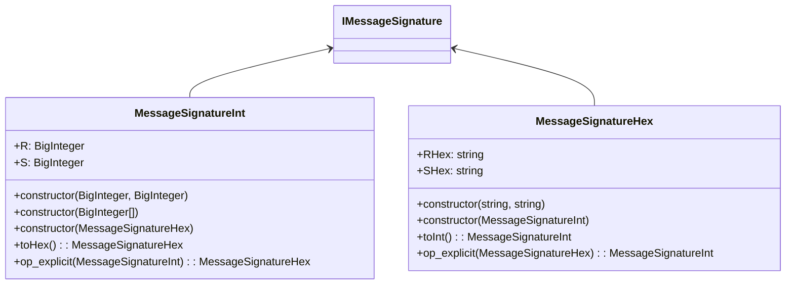
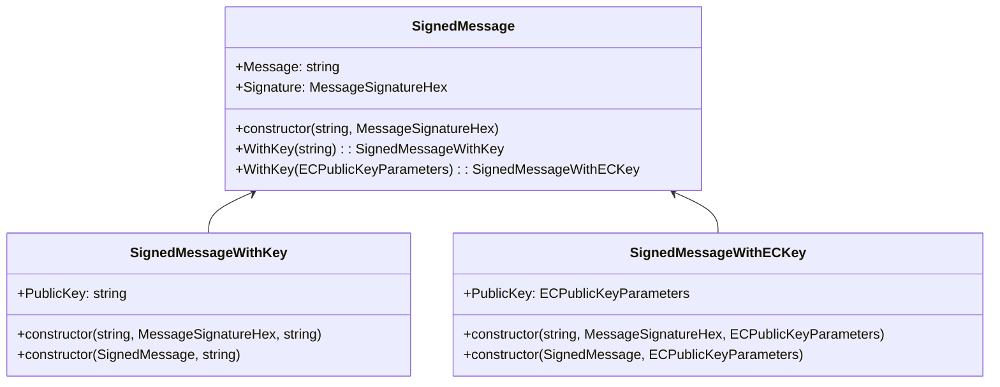
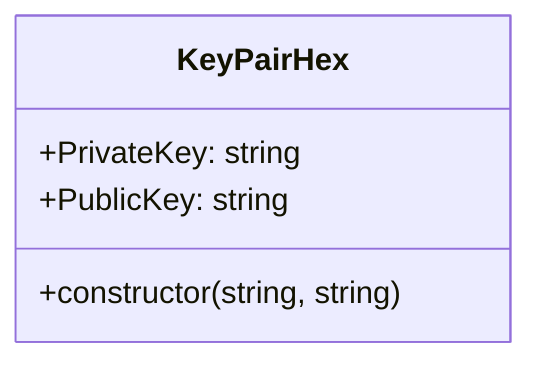
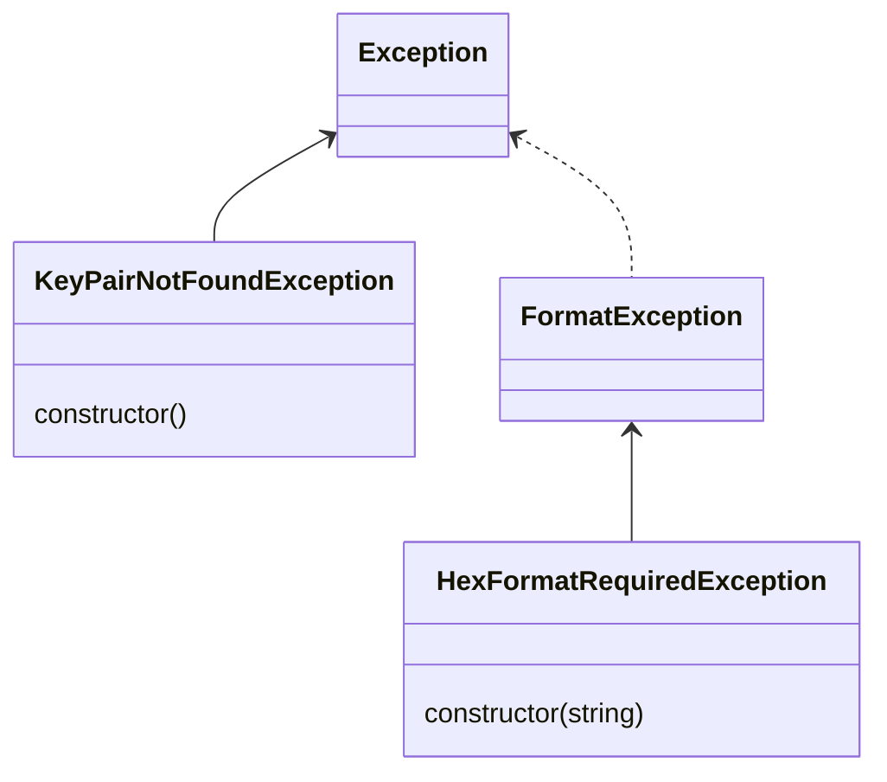

# Sessionless

This is the C# implementation of the Sessionless protocol--a protocol for providing auth without user data like emails, passwords, or sessions.


## Usage

### Install

<a href="https://nuget.org/packages/SessionlessNET">
    
</a>

- `dotnet add package SessionlessNET`

### Import

- Main implementations

```csharp
using SessionlessNET.Impl.Sessionless;
using SessionlessNET.Impl.Vault;
```

- Interfaces

```csharp
using SessionlessNET.Models.ISessionless;
using SessionlessNET.Models.IVault;
```

## Documentation:

Almost all classes / members have xaml documentation attached to them in source. This means your IDE will show you the documentation while hovering/viewing/etc...

<br/>

## `ISessionless` provides the following members:

### (Check out the [complete class diagrams below](#class-diagrams))

```csharp
public IVault Vault { get; }
```

> - The way to store and retrieve `KeyPairHex`s

<br/>

```csharp
public string GenerateUUID();
```

> - Creates a unique UUID for a user.

<br/>

```csharp
public KeyPairHex GenerateKeys();
```

> - Generates a private/public `KeyPairHex` and stores it using `Vault`
> - **Returns:** `KeyPairHex` that was generated

<br/>

```csharp
public Task<KeyPairHex> GenerateKeysAsync();
```

> - Generates a private/public `KeyPairHex` asynchronously and stores it using `Vault`
> - **Returns:** `KeyPairHex` that was generated

<br/>

```csharp
public KeyPairHex? GetKeys();
```

> - Retrieves keys using `Vault`
> - **Returns:** Key pair as `KeyPairHex`

<br/>

```csharp
public MessageSignatureHex Sign(string message);
```

> - Signs a message with the user's stored private key (Get from `Vault` using `GetKeys`)
> - **Parameters:**
>   - `message` The message to be signed
> - **Returns:** Signature as a `MessageSignatureHex`

<br/>

```csharp
public MessageSignatureHex Sign(string message, string privateKeyHex);
```

> - Signs a message using the provided `privateKeyHex`
> - **Parameters:**
>   - `message` The message to be signed
>   - `privateKeyHex` The private key in hex format to use for signing
> - **Returns:** Signature as a `MessageSignatureHex`

<br/>

```csharp
public MessageSignatureHex Sign(string message, ECPrivateKeyParameters privateKey);
```

> - Signs a message using the provided `privateKey`
> - **Parameters:**
>   - `message` The message to be signed
>   - `privateKey` The private key to use for signing
> - **Returns:** Signature as a `MessageSignatureHex`

<br/>

```csharp
public bool VerifySignature(SignedMessage signedMessage);
```

> - Verifies a given signed message with the user's stored public key
> - **Parameters:**
>   - `signedMessage` The message that was signed earlier
> - **Returns:** True if the signature is valid for the given message and public key

<br/>

```csharp
public bool VerifySignature(SignedMessageWithKey signedMessage);
```

> - Verifies a given signed message with the included `SignedMessageWithKey.PublicKey`
> - **Parameters:**
>   - `signedMessage` The message that was signed earlier
> - **Returns:** True if the signature is valid for the given message and public key

<br/>

```csharp
public bool VerifySignature(SignedMessageWithECKey signedMessage);
```

> - Verifies a given signed message with the included `SignedMessageWithECKey.PublicKey`
> - **Parameters:**
>   - `signedMessage` The message that was signed earlier
> - **Returns:** True if the signature is valid for the given message and public key

<br/>

```csharp
public bool Associate(params SignedMessage[] messages);
```

> - Verifies each of the `messages`
> - **Parameters:**
>   - `...messages` Messages to be verified
> - **Returns:** True if all signatures were verified successfully
> - **Throws:**
>   - `ArgumentException` if the messages count is <2

> For more on associating keys check out [this section of the dev README][associate].

<br/>
<br/>

## More information

Check out the docs [in the repo][readme-dev]

<br/>
<br/>

## Class diagrams

- ### `SessionlessNET.Models.`**`ISessionless`**



- ### `SessionlessNET.Models.`**`IVault`**


- ### `SessionlessNET.Impl.`**`MessageSignature`**



- ### `SessionlessNET.Impl.`**`MessageSignature`**



- ### `SessionlessNET.Impl.`...



- ### `SessionlessNET.Impl.Exceptions.`...



[readme-dev]: https://github.com/planet-nine-app/README-DEV.md
[examples]: https://github.com/planet-nine-app/sessionless
[associate]: https://github.com/planet-nine-app/sessionless/blob/main/README-DEV.md#primary-and-secondary-systems-and-why-sessionless-is-different
