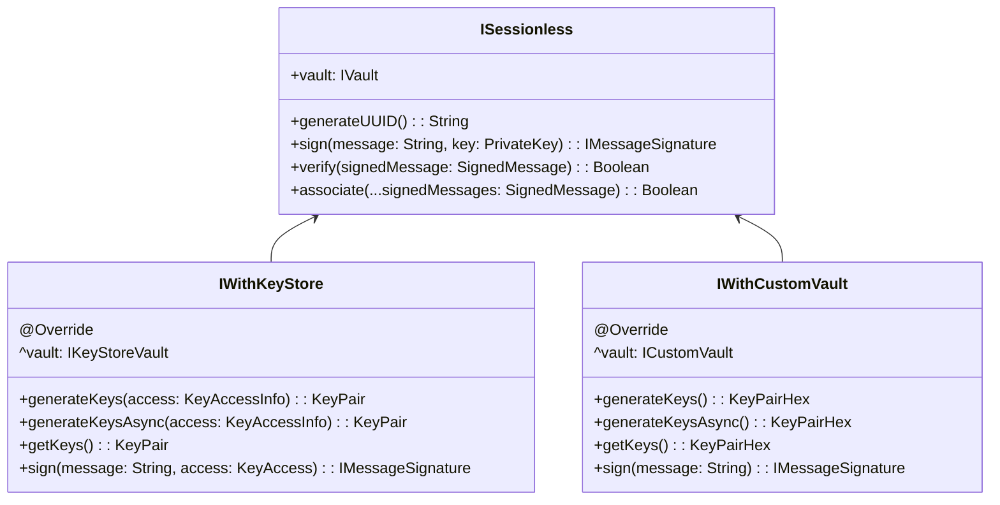
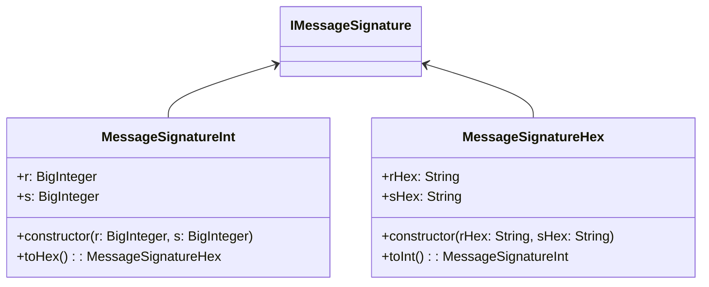
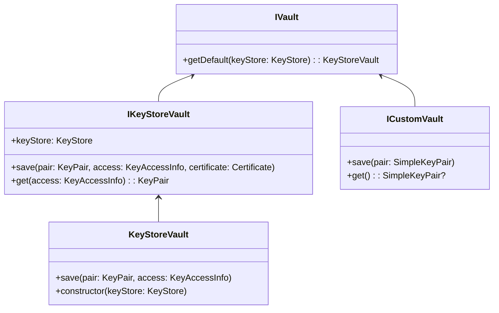
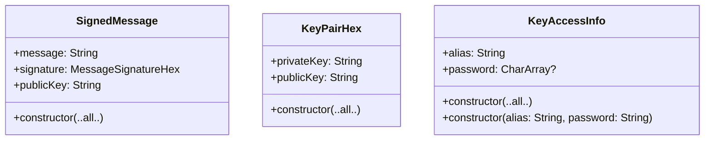

# [ISessionless](./src/main/kotlin/com/planetnine/sessionless/models/ISessionless.kt):

# [MessageSignature](./src/main/kotlin/com/planetnine/sessionless/impl/MessageSignature.kt):

# [IVault](./src/main/kotlin/com/planetnine/sessionless/models/IVault.kt):

# The rest:

