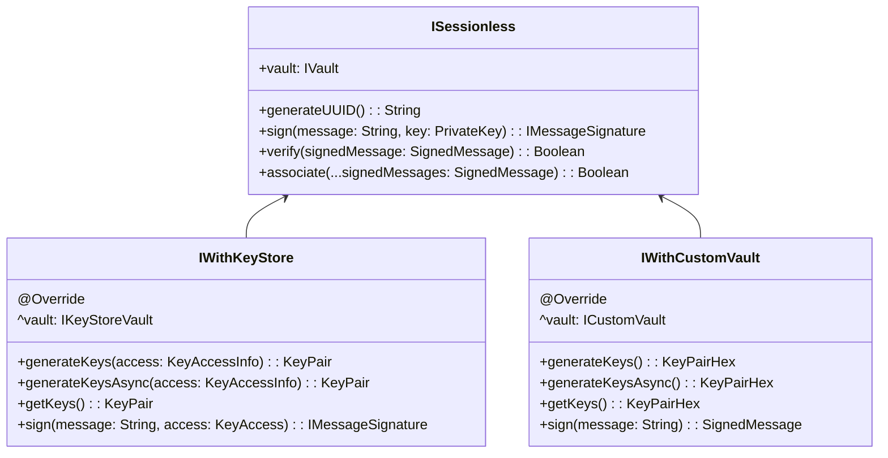
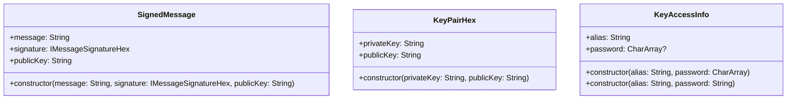

# [Sessionless](./src/main/kotlin/com/planetnine/sessionless/models/ISessionless.kt) interface:

# [MessageSignature](./src/main/kotlin/com/planetnine/sessionless/models/IMessageSignature.kt) interface:

# [Vault](./src/main/kotlin/com/planetnine/sessionless/models/IVault.kt) interface:

# The rest:

